# ChaseTheMoonlite Backend Docs

Swagger link: localhost:8080/doc
## Open terminal 

* open `terminal` command window "cmd"

## Postgres db setup

Install `pgAdmin4` (download latest version) : 
https://www.pgadmin.org/download/pgadmin-4-windows/

Make sure to have `psql` command in PATH

### 1. 
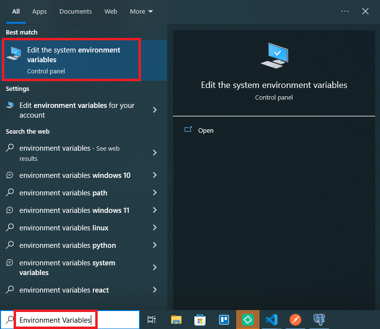

### 2.
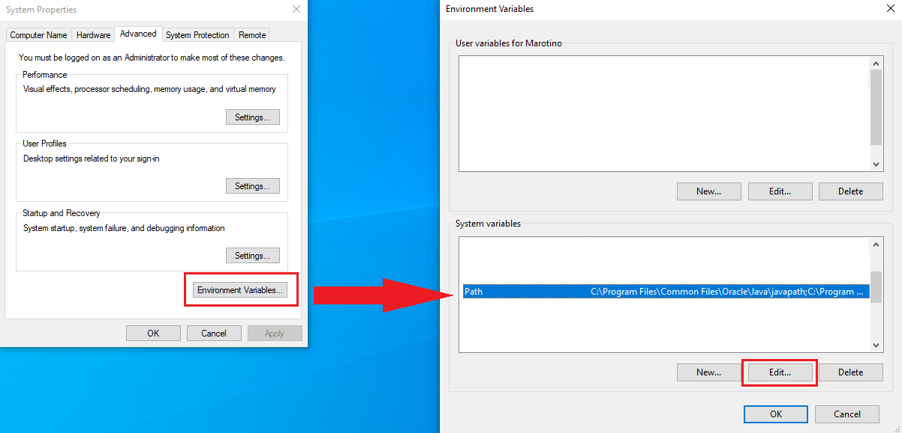 

### 3. 
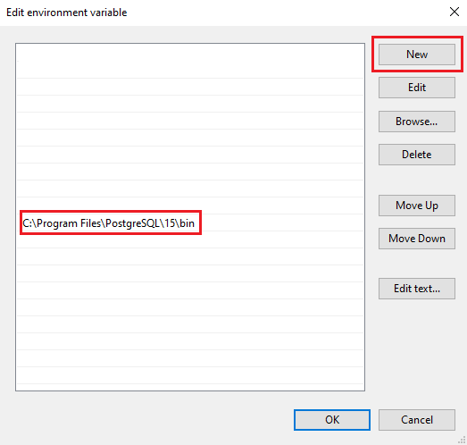

`C:\Program Files\PostgreSQL\15\bin` it is path from PostgresSQL folder. You should find your own path and paste.

Create Admin User with name `postgres` (it should be created automatically and you should only provide password): 

`In terminal`:
* log in to your postgres account using command `psql -U postgres`
* provide password (make up your own password)- password wont be visible

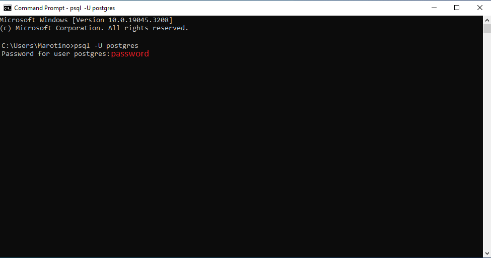

### Execute below commands in `terminal:`
* `create database ctm;` -> Create database with name ctm
* `create user ctmadmin with encrypted password 'changeitlater';` -> Create user `ctmadmin` with password `changeitlater`
* `grant all privileges on database ctm to ctmadmin;` -> Grant accesses for user
* `alter database ctm owner to ctmadmin;` -> Make ctmadmin an owner of this db
* `alter user ctmadmin with superuser;` 
* `\q` -> End psql session as `postgres` user
* `psql -d ctm -U ctmadmin;` -> log in as ctmadmin

## Importing .sql schema

Database schema is present in directory: src/db/schemas
- Using `terminal`

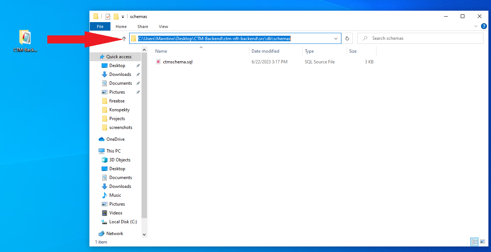

`psql -d ctm -U ctmadmin -f ctmschema.sql` <- ctmschema.sql should be a directory of schema

- Open pgAdmin4

## Exporting .sql schema

- open terminal
- change directory to root directory of ctm-nft-backend
- `pg_dump -U postgres --schema-only ctm > ctmschema.sql` execute command to create schema.sql file
-  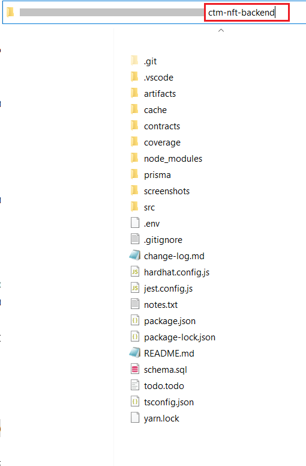
-  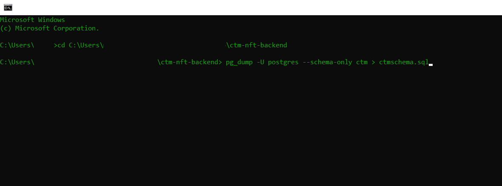

- Now database should be set up correctly

# Setting up backend

open terminal and go to root directory of project
- install all dependencies using command `yarn install`

## In `.env` file
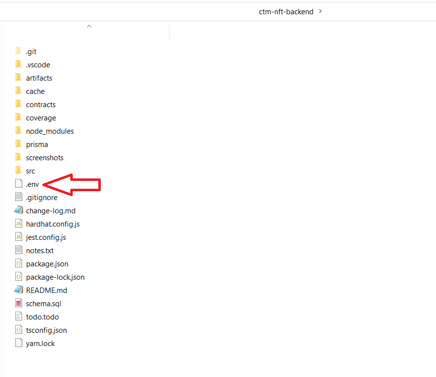  

### Thirdweb

- to build your contract run in terminal `npx thirdweb build`  

- deploy contract smart contract run interminal `npx thirdweb deploy`  

- go to the link provided (marked in red above) 
- connect wallet   
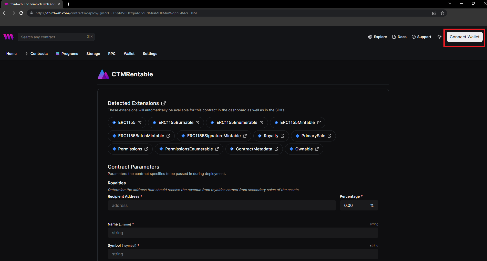
- fill the field - remember use wallet address provided in env file as admin wallet  
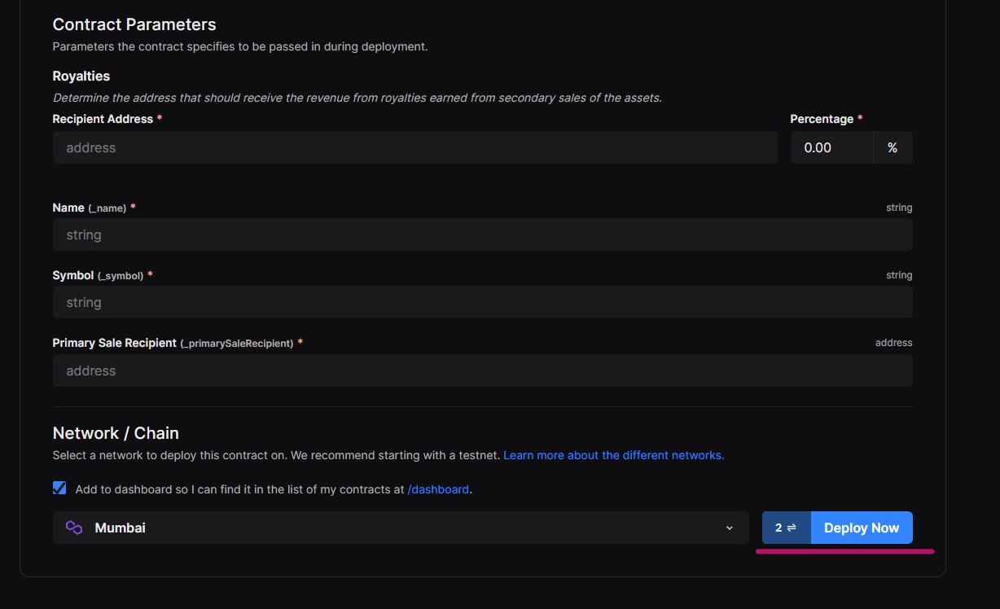  
- go to contracts to see your deployed contract
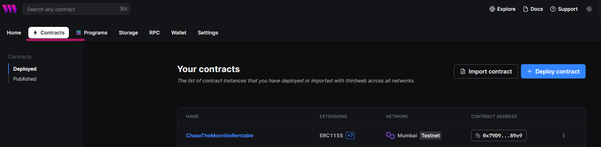

## How to run server

First - please make sure that database is up and running. With the schema provided in this project directory

- Enter project directory

`cd path_to_directory`

- Install all dependencies

`npm install`

- Run prisma command

`npx prisma generate`

- Run server (it runs on port 8080)

`npm start`